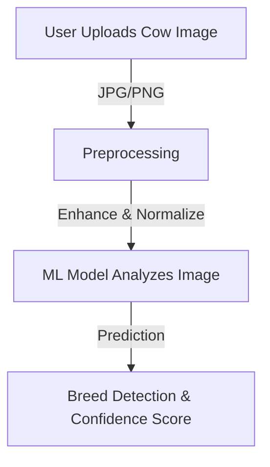
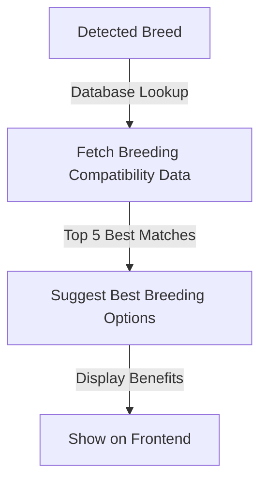
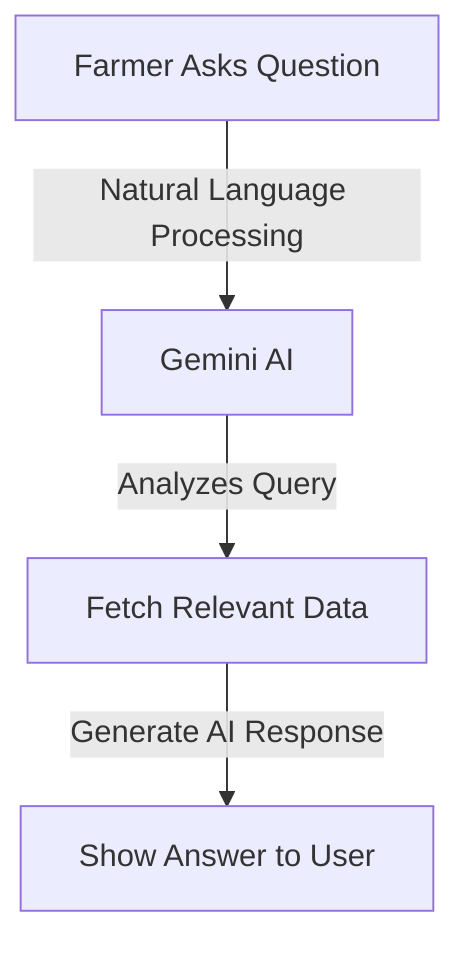
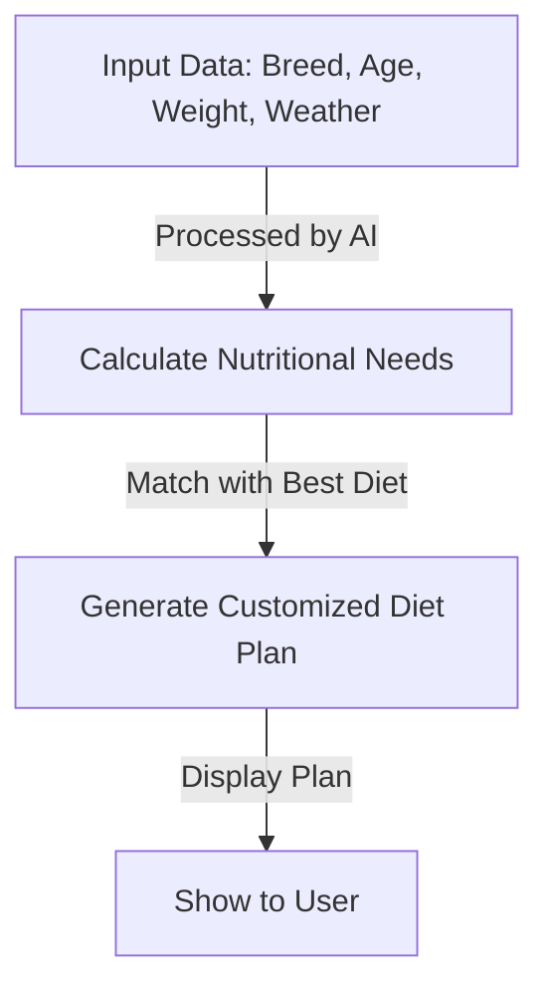

# 🌊🐄 AquaBov – AI-Powered Cattle Breed Detection & Smart Assistance


🔗 **[Live Demo](#)** | 🐝 **[Project Repository](https://github.com/Maheshh-S/AquaBov/)** | 💡 **Empowering Farmers with AI**

---

## 🚀 Introduction

**AquaBov** is an **AI-powered cattle breed detection and advisory platform** designed specifically for farmers, bringing the power of **Machine Learning & AI** to the agricultural sector. With just a **photo upload**, farmers can:

✅ **Identify their cattle's breed** using a **custom-trained ML model (4,500+ images)**
✅ **Receive smart breeding suggestions** for producing healthy, high-yield offspring
✅ **Chat in real-time** with **Dr. Moo**, an AI-powered cattle assistant
✅ **Get a personalized nutrition plan** based on the cow's **breed, age, weight, and local weather**

### 🌟 Why AquaBov?
- 🔄 **Bridging AI & Agriculture** – Bringing data-driven insights to farmers
- 🌍 **Real-World Impact** – Improving cattle health and milk production
- 🎨 **User-Friendly** – Simple interface, designed for **rural farmers**

---

## 💪 How It Works (Step-by-Step)

### 📝 AquaBov Workflow

```mermaid
graph TD;
    A[Farmer Uploads Cow Image] --> B[Backend (Flask API)]
    B --> C[ML Model Predicts Breed]
    C --> D[Store Data in Database]
    D --> E[Generate Smart Breeding Suggestions]
    D --> F[Provide Personalized Nutrition Plan]
    D --> G[Enable AI Chat with Dr. Moo]
    E --> H[Show Results to User]
    F --> H
    G --> H
```

### 🌱 Detailed Flowcharts

#### **🐾 Step 1: Image Upload & Breed Detection**


#### **🐾 Step 2: Smart Breeding Recommendations**


#### **🐾 Step 3: AI Chat with Dr. Moo**


#### **🐾 Step 4: Personalized Nutrition Plan**


---

## 💪 Key Features

✅ **🌀 AI-Powered Breed Detection** – **Highly accurate ML model** trained on 4,500+ images  
✅ **🐕 Smart Breeding Suggestions** – Find the **best crossbreeding partners**  
✅ **💬 Dr. Moo AI Chatbot** – **Instant answers** to cattle-related queries  
✅ **🍽️ Custom Nutrition Plan** – Optimized diet based on breed, age & location  
✅ **🏡 Rural-Friendly UI** – Designed with **farmers in mind**  

---

## 🌧️ Tech Stack

| **Category**     | **Technology Used** |
|-----------------|------------------|
| **Frontend**  | React.js, Tailwind CSS |
| **Backend**   | Python, Flask, Flask REST API |
| **Database**  | MongoDB |
| **Machine Learning** | Custom-trained ML model (4,500+ images) |
| **AI Model** | Gemini AI (Google) |
| **Cloud & Hosting** | Firebase / Vercel (Planned) |
| **APIs** | Gemini API (for chat), Weather API (for location-based nutrition) |

---

## 🛠️ Project Status

📅 **Current Development:**
- 📅 **Database & User Authentication System (in progress)**
- 🚀 **Image Upload & ML Model Integration (Complete)**

🔄 **Next Steps:**
- 🌐 **Deploy Backend on Firebase/Vercel**
- 🔦 **Enhance AI Chat Assistant (Dr. Moo)**
- 🏢 **Optimize Nutrition Plan for More Breeds**

---

## 🌌 Future Scope

🚀 **1. Mobile App Version** – Android/iOS app for wider accessibility  
🚀 **2. Voice-Based Support** – Farmers can interact with **Dr. Moo using voice commands**  
🚀 **3. Disease Detection** – AI-based **disease detection from cattle images**  
🚀 **4. Blockchain for Cattle Records** – Secure digital ownership & health records  
🚀 **5. Community Marketplace** – Farmer-to-farmer **network for cattle trading**  

---

## 📞 Contact

📧 **Email:** [your-email@example.com]  
🐝 **GitHub:** [Maheshh-S](https://github.com/Maheshh-S)  
🌐 **Website:** [AquaBov.com](#)  

---

## 🌟 Show Some Love!

If you liked this project, **don’t forget to star ⭐ the repo!**  

📢 _"Revolutionizing cattle farming with AI—one breed at a time!"_ 🐄✨

