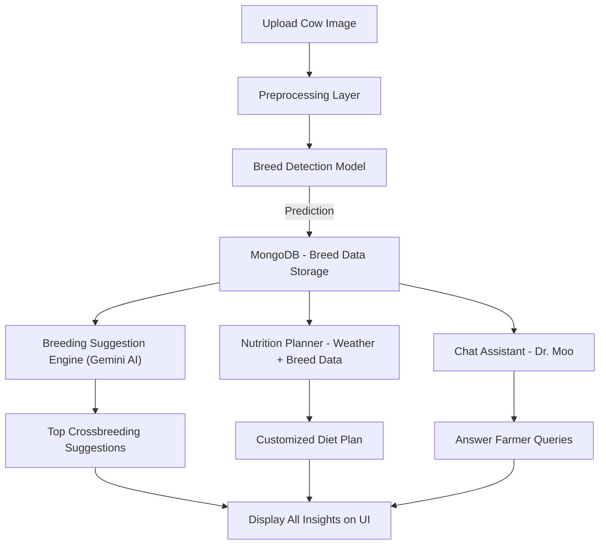
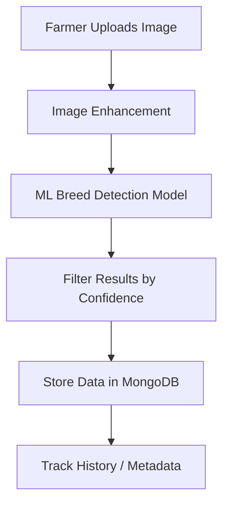
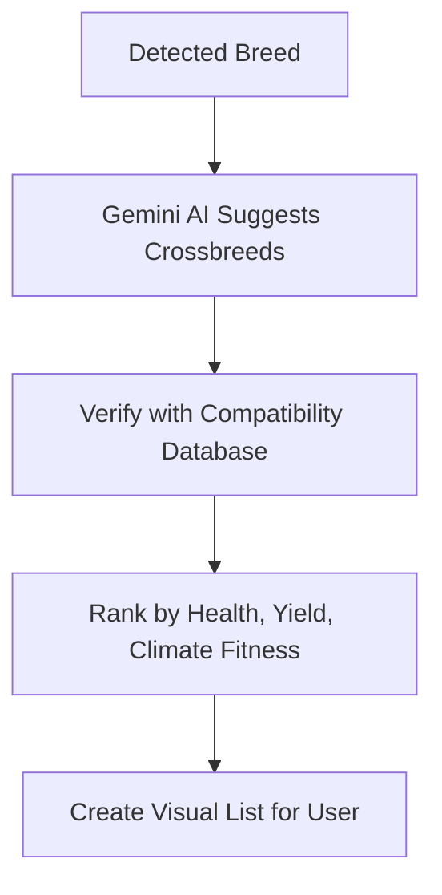
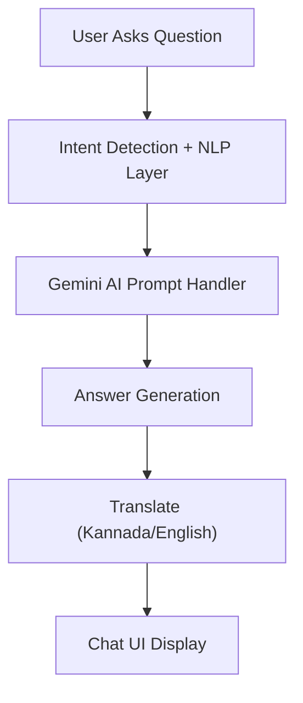
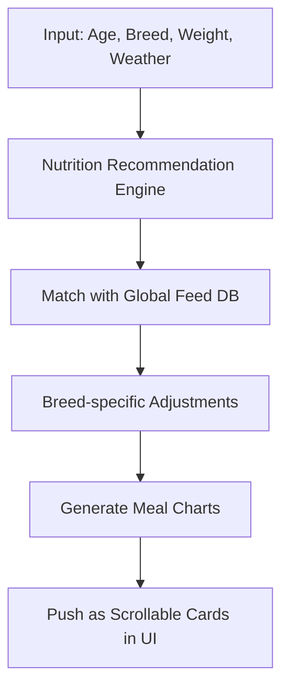

# 🌊🐄 AquaBov – AI-Powered Cattle Breed Detection & Smart Assistance

🔗 **[Live Demo](https://aqua-bov.vercel.app/)** | 🐝 **[Project Repository](https://github.com/Maheshh-S/AquaBov/)** | 💡 **Empowering Farmers with AI**

---

## 🚀 Introduction

**AquaBov** is an **AI-powered cattle breed detection and advisory platform** built to make **AI accessible to farmers**. By simply uploading a **photo**, farmers can:

✅ **Identify their cattle's breed** with a **custom-trained machine learning model** (trained on 4,500+ images)  
✅ **Receive smart breeding suggestions** to improve yield and cattle health  
✅ **Chat in real-time** with **Dr. Moo**, an AI-powered cattle assistant  
✅ **Get personalized nutrition plans** based on breed, age, weight, and local weather  

### 🌟 Why AquaBov?
- 🔄 **Bridging AI & Agriculture** – Bringing data-driven tools to empower farmers
- 🌍 **Real-World Impact** – Better cattle health and improved productivity
- 🎨 **User-Centered Design** – Clean interface tailored for rural users

---

## 💡 How It Works

### 🗘️ Step-by-Step Flow

### 📸 Image Upload & Detection

### 🔬 Breeding Suggestion Engine

### 💬 Dr. Moo Chatbot

### 🍽️ Nutrition Planning Engine

---

## 🚀 Key Features

- ✅ **Breed Detection** – ML model trained on **4,500+ labeled images**
- ✅ **Crossbreeding Suggestions** – Gemini AI recommends **top 5 healthy pairs**
- ✅ **Dr. Moo Chatbot** – Real-time **cattle expert assistant**
- ✅ **Personalized Nutrition Plans** – Daily & weekly plans based on breed, age & climate
- ✅ **Farmer-Friendly UI** – Built with simplicity and accessibility in mind

---

## ☔️ Tech Stack

| **Category** | **Technology** |
|--------------|----------------|
| **Frontend** | React.js, Tailwind CSS |
| **Backend** | Flask (Python), REST API |
| **Database** | MongoDB |
| **ML Model** | Custom-trained on 4,500+ cattle images |
| **AI Assistant** | Gemini AI (Chat + Breeding + Diet Suggestions) |
| **Hosting** | Firebase (Backend), Vercel (Frontend) |
| **APIs** | Gemini AI, Weather API |

---

## 📅 Development Timeline

- ✅ **ML Model Integration & Testing**
- ✅ **Frontend + Image Upload UI**
- ✅ **Chatbot with Gemini API**
- ⏳ **Database Integration + Auth System (Ongoing)**
- ⏳ **Mobile Responsiveness + UX Optimizations (Next)**

---

## 📷 Live Demo Preview

- **Breed Detected:** Gir
- **Confidence:** 96.2%
- **Nutrition Tip:** Add protein-rich feed during hot weather.
- **Suggested Crossbreed:** Gir x Sahiwal – Best for yield and heat resistance

---

## 🌌 Future Scope

- 🚀 **Mobile App (Android/iOS)**
- 🎤 **Voice Support in Local Languages**
- 💉 **Disease Detection via Image Analysis**
- 🔐 **Blockchain for Cattle Medical History**
- 🏢 **Farmer Marketplace for Cattle Trading**

---

## 📞 Contact

- ✉️ **Email:** your-email@example.com  
- 🐝 **GitHub:** [Maheshh-S](https://github.com/Maheshh-S)  
- 🌐 **Live Site:** [aqua-bov.vercel.app](https://aqua-bov.vercel.app/)

---

## ✨ Show Some Love

If this project helped or inspired you, consider giving it a **star ⭐ on GitHub!**

> _"Empowering farmers with AI, one cow at a time!"_ 🐄️🌱

