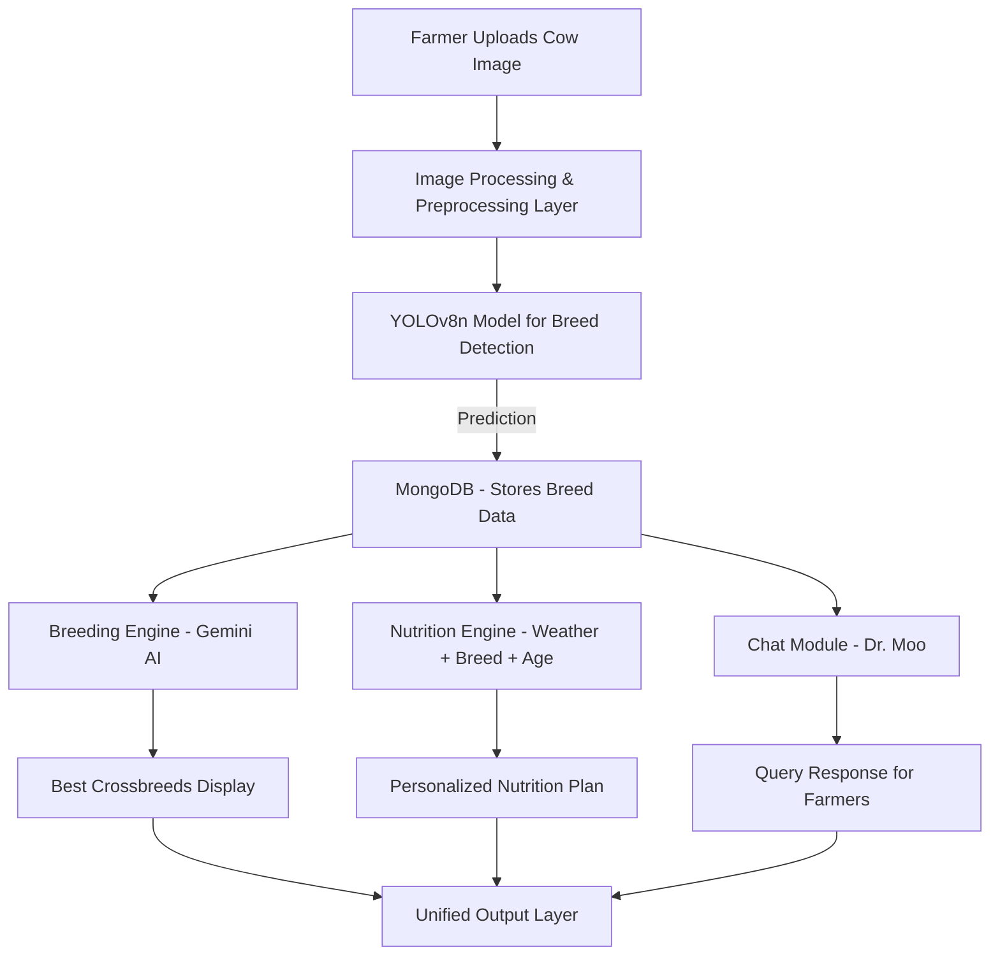
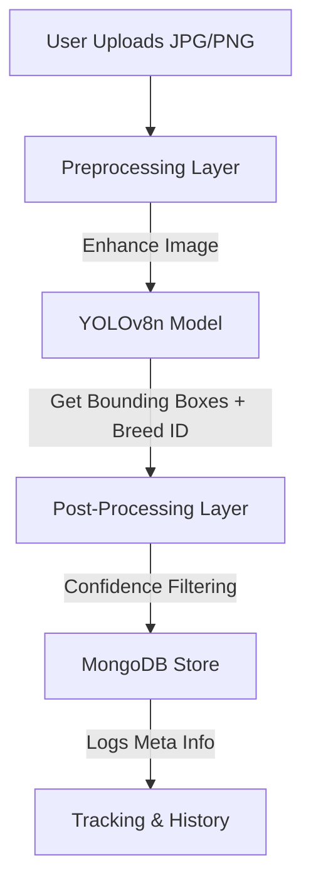
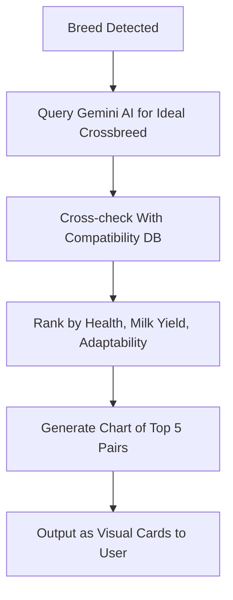
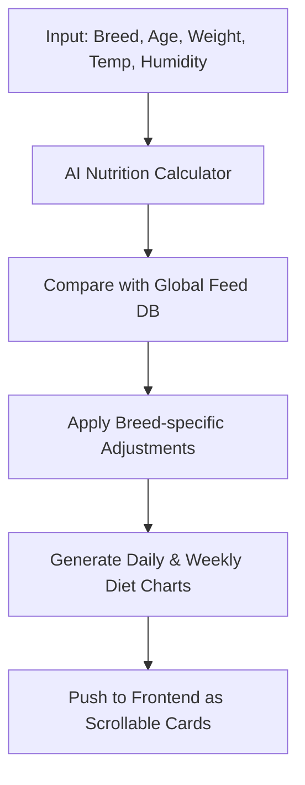

# 🌊🐄 AquaBov – AI-Powered Cattle Breed Detection & Smart Assistance


🔗 **[Live Demo](https://aqua-bov.vercel.app/)** | 🐝 **[Project Repository](https://github.com/Maheshh-S/AquaBov/)** | 💡 **Empowering Farmers with AI**

---

## 🚀 Introduction

**AquaBov** is an **AI-powered cattle breed detection and advisory platform** designed to bring **Machine Learning & AI** to farmers. With just a **photo upload**, farmers can:

✅ **Identify their cattle's breed** using a **custom-trained ML model (4,500+ images)**  
✅ **Receive smart breeding suggestions** for producing healthy, high-yield offspring  
✅ **Chat in real-time** with **Dr. Moo**, an AI-powered cattle assistant  
✅ **Get a personalized nutrition plan** based on the cow's **breed, age, weight, and local weather**  

### 🌟 Why AquaBov?
- 🔄 **Bridging AI & Agriculture** – Bringing data-driven insights to farmers  
- 🌍 **Real-World Impact** – Improving cattle health and milk production  
- 🎨 **User-Friendly** – Simple interface, designed for **rural farmers**  

---

## 💡 How It Works (Step-by-Step)

### 📝 AquaBov Workflow


### 📌 Complex Functional Flowcharts

#### 📸 Step 1: Image Upload & Breed Detection


#### 🔬 Step 2: AI-Powered Breeding Suggestions


#### 💬 Step 3: Conversational AI - Dr. Moo
```mermaid
graph TD;
    Q[Farmer Types a Question] --> A[NLP Processor]
    A --> B[Intent Classification & Context Fetching]
    B --> C[Gemini AI - Prompt Engineering Layer]
    C --> D[Relevant Answer Generation]
    D --> E[Language Conversion (Kannada/English)]
    E --> F[UI - Chat Interface Display]
```

#### 🍽️ Step 4: Nutrition Plan Generator


---

## 🚀 Key Features

✅ **🌀 AI-Powered Breed Detection** – **Trained on 4,500+ images**  
✅ **🐕 Smart Breeding Suggestions** – Find the **best crossbreeding partners**  
✅ **💬 Dr. Moo AI Chatbot** – **Instant answers** to cattle-related queries  
✅ **🍽️ Custom Nutrition Plan** – Optimized diet based on breed, age & location  
✅ **🏡 Rural-Friendly UI** – Designed for **farmers**  

---

## ☂️ Tech Stack

| **Category**     | **Technology Used** |
|-----------------|------------------|
| **Frontend**  | React.js, Tailwind CSS |
| **Backend**   | Python, Flask, Flask REST API |
| **Database**  | MongoDB |
| **Machine Learning** | Custom-trained YOLOv8n model (Roboflow, 4,500+ images) |
| **AI Model** | Gemini AI (Google) |
| **Cloud & Hosting** | Firebase / Vercel |
| **APIs** | Gemini API (for chat), Weather API (for location-based nutrition) |

---

## 📌 Project Status

🗓️ **Current Development:**  
- 🔧 **Database & User Authentication System (In Progress)**  
- ✅ **Image Upload & ML Model Integration (Completed)**  

🔄 **Next Steps:**  
- 🌐 **Deploy Backend on Firebase/Vercel**  
- 🔦 **Enhance AI Chat Assistant (Dr. Moo)**  
- 📈 **Optimize Nutrition Plan for More Breeds**  

---

## 📷 Sample Image Upload & Result (Demo)

Upload a cow image and instantly see its breed along with personalized insights:


- ✅ **Detected Breed:** Gir  
- 📈 **Confidence:** 96.2%  
- 🌱 **Nutrition Tip:** Add more protein-rich feed in summer for better lactation.  
- 🧬 **Breeding Suggestion:** Cross with Sahiwal for high-yield, heat-tolerant calves.  

---

## 🌌 Future Scope

🚀 **1. Mobile App Version** – Android/iOS app for wider accessibility  
🚀 **2. Voice-Based Support** – Farmers can interact with **Dr. Moo using voice commands**  
🚀 **3. Disease Detection** – AI-based **disease detection from cattle images**  
🚀 **4. Blockchain for Cattle Records** – Secure digital ownership & health records  
🚀 **5. Community Marketplace** – Farmer-to-farmer **network for cattle trading**  

---

## 📞 Contact

📧 **Email:** [your-email@example.com]  
🐝 **GitHub:** [Maheshh-S](https://github.com/Maheshh-S)  
🌐 **Website:** [https://aqua-bov.vercel.app/](https://aqua-bov.vercel.app/)  

---

## 🌟 Show Some Love!

If you liked this project, **don’t forget to star ⭐ the repo!**  

📢 _"Revolutionizing cattle farming with AI—one breed at a time!"_ 🐄✨

